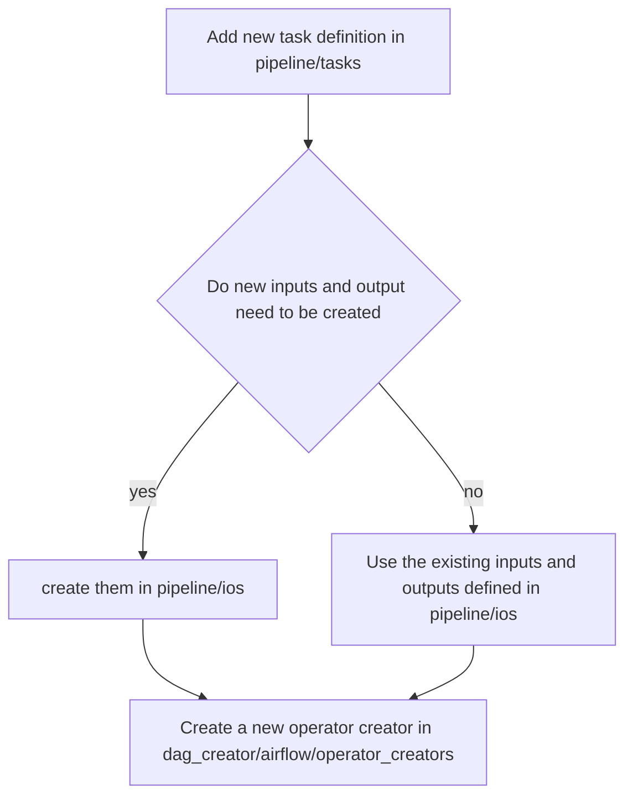

# Dagger
Dagger is a light framework that can convert simple yaml files into complex Airflow dags. It makes your pipelines more re-usable and more structured. Based on matching the inputs and outputs of your etl jobs it can visualise the full dependency graph of your workflows including your datasets as well.


# Folder structure

```bash
.
├── dagger
│   ├── alerts
│   ├── cli
│   ├── config_finder
│   ├── dag_creator # takes the graph object and outputs it into the respective format
│   │   ├── airflow # generates dag definitions based on graph object
│   │   │   ├── hooks
│   │   │   ├── operator_creators # contains modules to create task specific operator
│   │   │   ├── operators # custom airflow creators that can be used in the operator creator
│   │   │   └── utils 
│   │   ├── elastic_search
│   │   └── neo4j
│   ├── graph # module that builds up a graph by matching inputs and outputs different task definitions.
│   ├── pipeline 
│   │   ├── ios # contains definition of the specific inputs and outputs of a task
│   │   └── tasks # contains definition of the task configurations  
│   └── utilities
├── dagger_ui
│   └── app
├── dockers
│   ├── airflow
│   └── dagger_ui
├── docs
├── extras
├── reqs
├── tests
│   ├── dag_creator
│   ├── fixtures
│   ├── graph
│   ├── pipeline
│   └── utilities
```

How to install
--------
* `virtualenv -p python3 venv`
* `. venv/bin/activate`
* `make install`
* `dagger --help`

How to install for development
--------
* `make install-dev`
* `. venv/bin/activate`

How to test locally
--------
* Build and start airflow in docker: `make test-airflow`
* Go to `localhost:8080` in your browser to see airflow UI.
    * User: dev_user
    * Password: dev_user
* Example Dagger dags are defined at tests/fixtures/config_finder/root/dags/ and mounted as the dags directory in the container


How to use it
--------
* Install it where airflow is running
* Put the dagger/collect_dags.py into your airflow dags folder
* Create a directory for your new airflow pipeline
* With the help of dagger cli create a pipeline.yaml file in the directory: `dagger init-pipeline`
* With the help of dagger cli add task yaml configurations:
    * `dagger list-tasks`
    * `dagger init-task --type=<task_type>`
* With the help of dagger cli add your inputs and outputs to the task configuration file:
    * dagger list-ios
    * dagger init-io --type=<io_type>
* Check your airflow UI. Airflow dag is generated automatically and dependencies are set up based on matching inputs/outputs of tasks

How to add new Airflow task
-------



Plugins for dagger
-------

### Overview
Dagger now supports a plugin system that allows users to extend its functionality by adding custom Python classes. These plugins are integrated into the Jinja2 templating engine, enabling dynamic rendering of task configuration templates.
### Purpose
The plugin system allows users to define Python classes that can be loaded into the Jinja2 environment. When functions from these classes are invoked within a task configuration template, they are rendered dynamically using Jinja2. This feature enhances the flexibility of task configurations by allowing custom logic to be embedded directly in the templates.

### Usage
1. **Creating a Plugin:** To create a new plugin, define a Python class in a folder(for example `plugins/sample_plugin/sample_plugin.py`) with the desired methods. For example:
```python
class MyCustomPlugin:
    def generate_input(self, branch_name):
        return [{"name": f"{branch_name}", "type": "dummy"}]
```
This class defines a `generate_input` method that takes the branch_name from the module config and returns a dummy dagger task.

2. **Loading the Plugin into Dagger:** To load this plugin into Dagger's Jinja2 environment, you need to register it in your `dagger_config.yaml`:
```yaml
# pipeline.yaml
plugin:
  paths: 
    - plugins # all Python classes within this path will be loaded into the Jinja environment
```

3. **Using Plugin Methods in Templates:** Once the plugin is loaded, you can call its methods from within any Jinja2 template in your task configurations:
```yaml
# task_configuration.yaml
type: batch
description: sample task
inputs:                        # format: list | Use dagger init-io cli
  {{ MyCustomPlugin.generate_input("dummy_input") }}
```


Credits
-------

This package was created with Cookiecutter_ and the `audreyr/cookiecutter-pypackage`_ project template.

.. _Cookiecutter: https://github.com/audreyr/cookiecutter
.. _`audreyr/cookiecutter-pypackage`: https://github.com/audreyr/cookiecutter-pypackage
